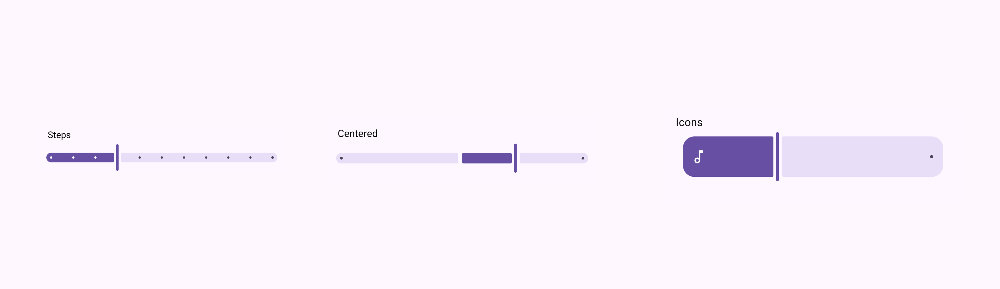
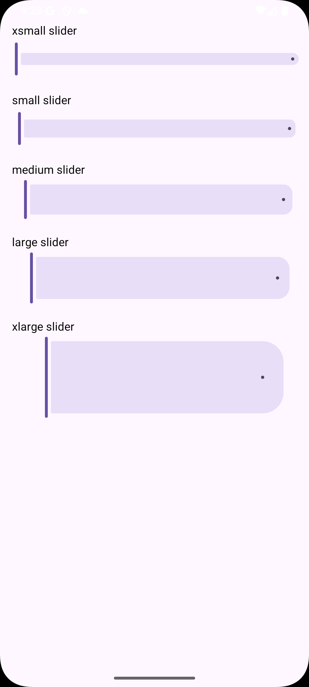

# @rn-nui/slider

Native sliders for React Native with enhanced functionality and customization options. This component provides Material 3 sliders with comprehensive styling and behavior controls.

## Installation

```bash
npm install @rn-nui/slider
```

or

```bash
yarn add @rn-nui/slider
```

### iOS Setup

Not yet supported.

### Android Setup

You'll need to override the theme of your app under `/android/app/src/main/res/values/styles.xml` to inherit from Material3Expressive.

```xml
<resources>
    <!-- Base application theme. -->
    <style name="AppTheme" parent="Theme.Material3Expressive.DayNight.NoActionBar">
      <!-- Customize your theme here -->
    </style>
</resources>
```

### Expo Setup

There is no plugin for Expo yet. You'll need to manually edit the native files as described above.

## Usage

```typescript
import { Slider } from '@rn-nui/slider';

// Basic slider
<Slider
  value={sliderValue}
  onValueChange={setSliderValue}
  minValue={0}
  maxValue={100}
/>

// Customized slider with presets for size and styling
<Slider
  size="lg"
  value={sliderValue}
  onValueChange={setSliderValue}
  minValue={0}
  maxValue={100}
  stepSize={5}
  activeTrackColor="#52796f"
  inactiveTrackColor="#e9ecef"
  thumbColor="#52796f"
  labelBehavior="floating"
  tickVisibilityMode="auto-limit"
  trackIconActiveStart="check_circle"
/>

// Centered slider (e.g., for audio panning)
<Slider
  value={panValue}
  onValueChange={setPanValue}
  minValue={-50}
  maxValue={50}
  centered={true}
/>
```

## API Reference

#### Properties

| Prop                     | Type                                      | Default     | Description                                                                                                                        |
| ------------------------ | ----------------------------------------- | ----------- | ---------------------------------------------------------------------------------------------------------------------------------- |
| `size`                   | `SliderSize`                              | `undefined` | Preset sizes controlling track height, thumb height and border radius. All these can be individually set instead of using a preset |
| `minValue`               | `number`                                  | `undefined` | Minimum value of the slider                                                                                                        |
| `maxValue`               | `number`                                  | `undefined` | Maximum value of the slider                                                                                                        |
| `stepSize`               | `number`                                  | `undefined` | Determines the snap points                                                                                                         |
| `value`                  | `number`                                  | `undefined` | Controlled value                                                                                                                   |
| `height`                 | `number`                                  | `undefined` | Height of the track                                                                                                                |
| `trackColor`             | `ColorValue`                              | `undefined` | Color of the entire track. Use `activeTrackColor` and `inactiveTrackColor` to control specific colors                              |
| `activeTrackColor`       | `ColorValue`                              | `undefined` | Color of the track to left of the thumb                                                                                            |
| `inactiveTrackColor`     | `ColorValue`                              | `undefined` | Color of the track to right of the thumb                                                                                           |
| `trackCornerSize`        | `number`                                  | `undefined` | Border radius of the track                                                                                                         |
| `trackInsideCornerSize`  | `number`                                  | `undefined` | Border radius between track and thumb                                                                                              |
| `trackIconActiveStart`   | `string`                                  | `undefined` | Icon displayed in active section at start of track                                                                                 |
| `trackIconActiveEnd`     | `string`                                  | `undefined` | Icon displayed in active section next to thumb                                                                                     |
| `trackIconInactiveStart` | `string`                                  | `undefined` | Icon display in inactive section next to thumb                                                                                     |
| `trackIconInactiveEnd`   | `string`                                  | `undefined` | Icon displayed in inactive section at end of track                                                                                 |
| `trackIconActiveColor`   | `ColorValue`                              | `undefined` | Color of icons in active section                                                                                                   |
| `trackIconInactiveColor` | `ColorValue`                              | `undefined` | Color of icons in inactive section                                                                                                 |
| `trackIconSize`          | `number`                                  | `undefined` | Size of icons                                                                                                                      |
| `trackStopIndicatorSize` | `number`                                  | `undefined` | Size of the stop circle at the end of track                                                                                        |
| `thumbColor`             | `ColorValue`                              | `undefined` | Color of the thumb                                                                                                                 |
| `thumbWidth`             | `number`                                  | `undefined` | Width of the thumb                                                                                                                 |
| `thumbHeight`            | `number`                                  | `undefined` | Height of the thumb                                                                                                                |
| `thumbElevation`         | `number`                                  | `undefined` | Elevation of the thumb                                                                                                             |
| `thumbBorderColor`       | `ColorValue`                              | `undefined` | Border color of the thumb                                                                                                          |
| `thumbBorderWidth`       | `number`                                  | `undefined` | Border width of the thumb                                                                                                          |
| `thumbTrackGapSize`      | `number`                                  | `undefined` | Space between thumb and track on both sides of thumb                                                                               |
| `labelBehavior`          | `SliderLabelBehavior`                     | `undefined` | Behavior of label displaying current value                                                                                         |
| `tickColor`              | `ColorValue`                              | `undefined` | Color of ticks, regardless of active or inactive. Use `activeTickColor` and `inactiveTickColor` to control specific colors.        |
| `activeTickColor`        | `ColorValue`                              | `undefined` | Color of ticks in active section                                                                                                   |
| `inactiveTickColor`      | `ColorValue`                              | `undefined` | Color of ticks in inactive section                                                                                                 |
| `activeTickRadius`       | `number`                                  | `undefined` | Border radius of ticks in active section                                                                                           |
| `inactiveTickRadius`     | `number`                                  | `undefined` | Border radius of ticks in inactive section                                                                                         |
| `tickVisibilityMode`     | `SliderTickVisibility`                    | `undefined` | Determines how the ticks are visible                                                                                               |
| `disabled`               | `boolean`                                 | `undefined` | If true, the user won't be able to interact with the slider                                                                        |
| `centered`               | `boolean`                                 | `undefined` | Controls if the active section is tied to the center of track                                                                      |
| `onChange`               | `(event: SliderValueChangeEvent) => void` | `undefined` | Callback called with the change event                                                                                              |
| `onValueChange`          | `(value: number) => void`                 | `undefined` | Callback called with just the new value                                                                                            |
| `onSlidingStart`         | `(value: number) => void`                 | `undefined` | Callback called when sliding starts                                                                                                |
| `onSlidingStop`          | `(value: number) => void`                 | `undefined` | Callback called when sliding stops                                                                                                 |

#### Type Definitions

##### `SliderSize`

```typescript
type SliderSize = 'xs' | 'sm' | 'md' | 'lg' | 'xl';
```

Preset sizes that control track height, thumb dimensions, and border radius.

##### `SliderLabelBehavior`

```typescript
type SliderLabelBehavior = 'always-visible' | 'floating' | 'never-visible';
```

- `'always-visible'`: The label is always visible
- `'floating'`: The label floats above the thumb when sliding
- `'never-visible'`: The label is never visible, even when sliding

##### `SliderTickVisibility`

```typescript
type SliderTickVisibility = 'auto-limit' | 'auto-hide' | 'hidden';
```

- `'auto-limit'`: Ticks are drawn. If there are too many, the maximum allowed number will be drawn
- `'auto-hide'`: Ticks are drawn. If there are too many, they are all hidden
- `'hidden'`: Ticks are always hidden (allows for snapping to points without showing ticks)

##### `SliderValueChangeEvent`

```typescript
type SliderValueChangeEvent = NativeSyntheticEvent<{
  target: number;
  value: number;
}>;
```

#### Events

##### onChange

Called when the slider value changes. The event object contains target and value properties.

##### onValueChange

Called when the slider value changes with just the new numeric value.

##### onSlidingStart

Called when the user starts sliding with the current value.

##### onSlidingStop

Called when the user stops sliding with the final value.

### Screenshots

| Centered                                             | Icons                                             | Preset sizes                                      | Steps                                             |
| ---------------------------------------------------- | ------------------------------------------------- | ------------------------------------------------- | ------------------------------------------------- |
|  |  |  |  |
